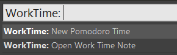
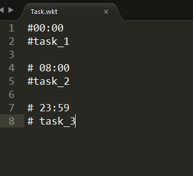

# WorkTime
> A SublimeText 2/3 package for time management

- Create a tomato time.  
- Make a list of tasks, and alerts.


## Install 
```bash
cd ../Sublime Text 3/Packages/
git clone https://github.com/FloydaGithub/WorkTime.git
```

## Usage
> default key bindings: **alt+shift+p**  


- New Pomodoro Time    
> create a pomodopro time about 25 minutes  


- Open Work Time Note  
> Open .wkt file and edit it  


- Show Status    
> Show sublime status message


- Hide Status    
> Hide sublime status message
